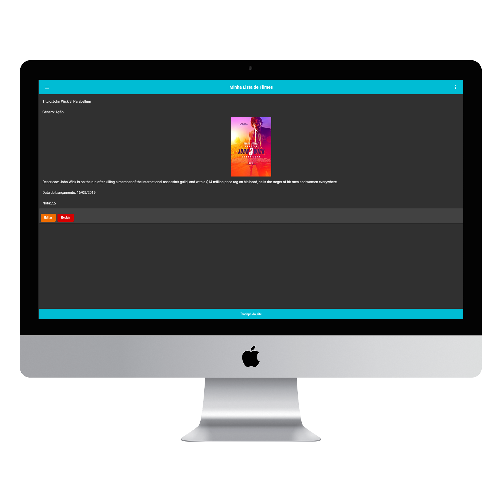

<h2 align="center">
  Angular-Filmes
</h2>

# 💻 Angular-Filmes
> Projeto feito no bootcamp da Digital Innovation One.

## 📷 Imagens

> Lista

 
    

> Pesquisa

 
    

> Filme

 
    

> Cadastro

 
    

# Repositório principal

https://github.com/RenanRB/curso-angular

# Curso Intermediário de Angular - Digital Innovation One

Esse curso foi feito para a plataforma [Digital Innovation One](https://digitalinnovation.one/)

O curso consiste em um sistema de filmes, com a possibilidade de cadastros, edições, listagem e visualização dos cursos de outros usuários.

## Instalação

1. clone o repositório `git clone git@github.com:RenanRB/curso-angular.git`
2. Entre no projeto e instale as dependencias `npm install`

## Ambiente Local

Execute `ng serve` para que o projeto suba localmente. Acesse a url `http://localhost:4200/`. O projeto já está com reload automático conforme as alterações que você realizar no código

## Simulando o Back-end

Execute `npm install -g json-server` para instalar globalmente o servidor json. Após a instalação entre na pasta do projeto e execute `json-server --watch db.json`, com isso um servidor será inicializado na url `http://localhost:3000/`, após a inicialização sera possível realizar requisições http.

## Gerendo componente

Execute `ng generate component nome-do-componente` para criar um novo componente. Você também pode usuar `ng generate directive|pipe|service|class|guard|interface|enum|module`.

## Build

Execute `ng build` para gerar o compilado do projeto. O projeto vai ser criado dentro do diretório `dist/`. Adicionar `--prod` junto comando de build para gerar minificado e pronto para o ambiente de produção.

